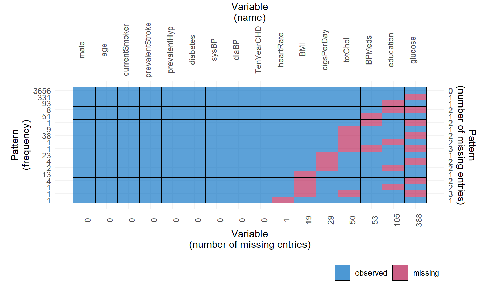
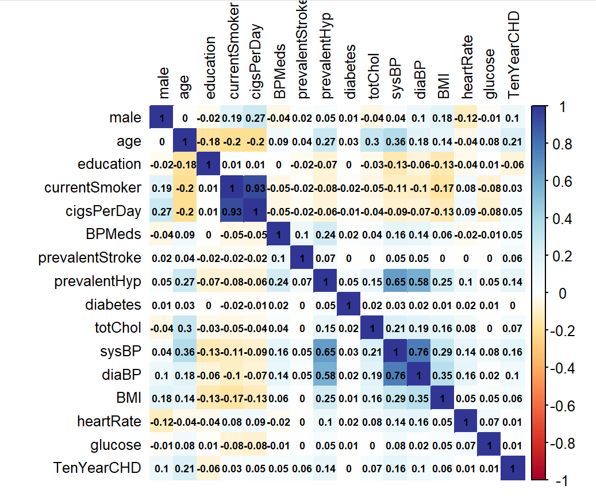
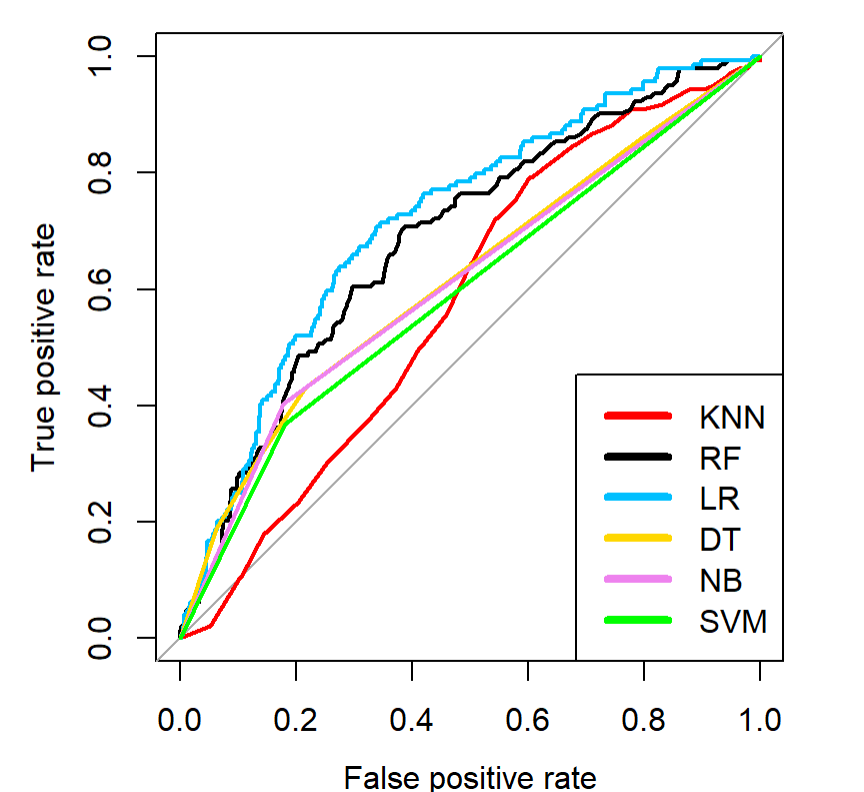
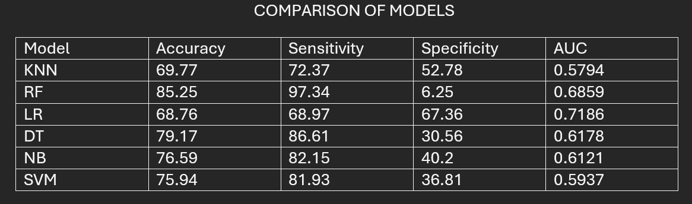

Coronary Heart Disease Prediction Using Machine Learning

Project Overview:
This project compares six machine learning algorithms for predicting coronary heart disease using the Framingham dataset.

Business Problem:
Early prediction of heart disease can help healthcare providers identify at-risk patients.

Dataset:
Framingham Heart Study Dataset

Tools Used:
- R
- Random Forest (RF)
- Logistic Regression (LR)
- Decision Tree (DT)
- Naive Bayes (NB)
- Support Vector Machines (SVM)
- K-Nearest Neighbours (KNN)
- Data Visualization

Methodology:
1. Data cleaning
2. Feature engineering
3. Model training
4. Model evaluation

Results:
Random Forest achieved 85.25% accuracy.

Future Improvements:
- Hyperparameter tuning
- Additional feature selection

## VISUALIZATIONS

## Missing Values

## Correlation Heatmap

## Feature Selection

## ROC curves

## Model Comparisons

